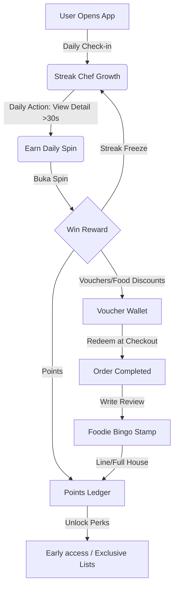

# LocalBuka Gamification Design & Implementation Guide
## Tailwind & Modern Web UI/UX Reference for Developers & Designers

This guide details the gamification mechanics, user experience layouts, and technical architecture for **LocalBuka**. It defines how UI/UX designers can design these features, how developers can implement them, and how an **Offline Gaming Mode** can be integrated into the web application to support continuous user engagement.

---

## 1. System Objective & Core Retention Loop

The primary goal of the LocalBuka Gamification System is to **maximize user retention (DAU/MAU)** and **drive core business actions** (restaurant discovery, saves, shares, and verified reviews).



---

## 2. UI/UX Design System & Components

For a premium feel, the UI/UX design must utilize modern patterns: **glassmorphism, smooth CSS transitions, custom HSL-based dark/light modes, and micro-animations**.

### A. The Dashboard Widget (Dashboard View)
*   **Streak Chef Avatar**: Positioned in the upper-right header. A dynamic SVG character that changes state (e.g., gets a chef hat at Day 3, a golden spatula at Day 14). Hovering displays a tooltip: *"Your Chef is hungry! View 1 new restaurant today to feed them."*
*   **Buka Spin CTA**: Floating Action Button (FAB) or high-visibility card with a subtle gradient-pulse animation:
    *   *Gradient*: `bg-gradient-to-r from-amber-500 to-red-500`
    *   *State Indicator*: Displays a lock icon if the qualifying 30-second view is incomplete, changing to a sparkling play icon once unlocked.
*   **Bingo Card Mini-Preview**: A compact $3\times3$ grid showing current stamps. Tapping expands it to a full-screen modal.

### B. Buka Spin (Daily Wheel) Modal
*   **Visual Style**: Sleek, circular wheel matching the LocalBuka color palette (Forest Green `#0F5132`, Warm Amber `#FFC107`, Cream white background, and Crimson accents).
*   **Animations**: 
    *   Uses HTML5 Canvas or CSS transitions for spinning.
    *   Ease-out deceleration curve (`cubic-bezier(0.1, 0.8, 0.3, 1)`) for the spin duration (3–4 seconds).
    *   A haptic tick sound/trigger on every segment pass.
    *   Confetti burst (`canvas-confetti` library) upon landing on a winning segment (e.g., ₦500 Voucher).

### C. Foodie Bingo Screen
*   **Layout**: $3\times3$ grid where each square represents a cuisine or restaurant tag (e.g., Buka, Fine Dining, Street Food).
*   **Micro-interactions**:
    *   *Locked State*: Grayed out with a subtle padlock.
    *   *Completed State*: The square flips with a 3D card rotation effect (`transform-style: preserve-3d`), revealing a colorful food icon and a stamp mark.
    *   *Line Complete*: A glowing neon line strikes through the row/column/diagonal, followed by a points-award dialog.

---

## 3. Offline Gaming Mode (Buka Dash & Offline Sync)

To keep users engaged even without internet access (e.g., in low-connectivity areas or transit), LocalBuka features a dedicated **Offline Gaming Mode**.

### A. The Offline Game: "Buka Dash" (Cuisine Matcher)
*   **Game Type**: A lightweight, client-side HTML5 match-3 or falling-ingredient game.
*   **Access**: Triggers automatically when the frontend detects offline status via `navigator.onLine = false` or failed API calls. A clean, retro "No Connection? Play Buka Dash!" overlay appears.
*   **Gameplay**: Catch falling Nigerian ingredients (Yam, Plantain, Tomato, Pepper) in a basket. Matching 3 ingredients in a row builds a "Recipe" (e.g., Jollof Rice).
*   **Offline Rewards**: Users earn "Pending Points" (max 20 points per offline session, capped at 50 points per day to prevent client-side script exploitation).

### B. Technical Implementation & Data Synchronization

To ensure points are stored securely and synchronized without duplication or cheating, the following architecture must be implemented:

```
[Offline Client] 
   | 1. Earn points in Buka Dash
   v
[IndexedDB / LocalStorage] -- (Saves encrypted gameplay payload + timestamp)
   |
   | 2. Network connection restored (online event listener)
   v
[Service Worker / Background Sync]
   | 3. Send payload + HMAC signature to Server
   v
[API Endpoint: /api/gamification/sync] 
   | 4. Validate signatures & timestamps
   v
[Database Ledger] (Points credited safely)
```

#### 1. Client-Side Offline Storage (IndexedDB/LocalStorage)
When offline rewards are earned, they are stored as encrypted string payloads in the browser's `indexedDB` or `localStorage`.

```javascript
// Structure of an offline session payload
const offlineSession = {
  sessionId: "sess_" + crypto.randomUUID(),
  timestamp: Date.now(),
  pointsEarned: 15,
  gameplayData: {
    score: 150,
    matchesMade: 10,
    playDurationMs: 120000,
    inputs: [/* tracking user inputs to detect bot manipulation */]
  }
};

// Encrypted with a client-side rolling session key before saving
localStorage.setItem('localbuka_offline_session', JSON.stringify(offlineSession));
```

#### 2. Background Synchronization Protocol
A Service Worker registers a sync tag to upload the data automatically once online.

```javascript
// service-worker.js
self.addEventListener('sync', (event) => {
  if (event.tag === 'sync-offline-points') {
    event.waitUntil(syncOfflinePoints());
  }
});

async function syncOfflinePoints() {
  const offlineData = JSON.parse(localStorage.getItem('localbuka_offline_session'));
  if (!offlineData) return;

  try {
    const response = await fetch('/api/gamification/sync', {
      method: 'POST',
      headers: {
        'Content-Type': 'application/json',
        'Authorization': `Bearer ${getAuthToken()}`
      },
      body: JSON.stringify(offlineData)
    });

    if (response.ok) {
      localStorage.removeItem('localbuka_offline_session');
      // Dispatch custom event to notify UI
      notifyUIOfSyncSuccess();
    }
  } catch (error) {
    console.error("Offline sync failed, will retry on next connection", error);
  }
}
```

#### 3. Anti-Exploit Guardrails for Offline Points
*   **Time-window Validation**: The server rejects sync requests with timestamps older than 24 hours.
*   **Gameplay Replay Check**: The server validates the `playDurationMs` against the `pointsEarned` (e.g., earning 50 points in 2 seconds is flagged and discarded).
*   **Strict Daily Cap**: A hard cap of 50 offline-sync points per day is enforced on the server-side, regardless of client claims.

---

## 4. Reward Fulfillment (Vouchers & Partner Discounts)

*   **Voucher Generation**: When a user wins a food discount (e.g., ₦500 off), the system creates a unique, single-use voucher code associated with their account.
*   **Inventory Checks**: The server tracks voucher inventory in real-time using Redis or DB transactions. If a partner restaurant's voucher stock hits 0, the reward defaults to a point-based equivalent.
*   **Expiry Urgency**: Partner vouchers expire after **30 days** to motivate immediate ordering. The app sends a push notification 3 days prior to expiration.

---

## 5. Walkthrough of Recommended Development Phases

1.  **Phase 1: Design Assets & Static UI** (UI/UX Designer)
    *   Design Chef Avatar growth SVG assets.
    *   Create Figma components for Bingo Grid, Buka Spin Wheel, and Offline Game UI.
2.  **Phase 2: Core Frontend & Online Game Logic** (Frontend Developer)
    *   Build interactive spin wheel and bingo layouts.
    *   Integrate API endpoints for spin result retrieval and bingo status.
3.  **Phase 3: Offline Mode & Sync Architecture** (Fullstack Developer)
    *   Write the HTML5 game Canvas for the offline matching game.
    *   Implement Service Worker cache policies and IndexedDB queue management.
    *   Implement secure server-side endpoint `/api/gamification/sync` with validation checks.
